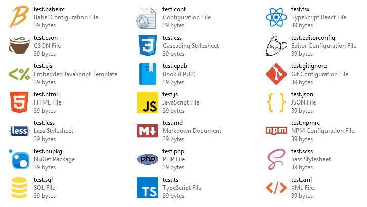

# Custom File Icons

Configuration-based file association manager for Windows (_not_ an icon suite).

Normally, setting various extensions to open in, say, your favorite editor would result in everything having that program's icon. This makes it difficult to differentiate file types at a glance. This tool instead lets you assign custom icons and associations (and even additional menu items, such as Pack/Unpack for NuGet specs/packages) to files using a simple json file which can be synced across machines.

## Usage

You'll need [Visual Studio](https://visualstudio.microsoft.com/vs/) or [VS Code](https://code.visualstudio.com/) / [.NET CLI](https://docs.microsoft.com/en-us/dotnet/core/tools/).

1. Fork or clone the repo and build the solution in Release mode.
2. Edit [config.json](config.json) (the included config and icons are my own and can be replaced).
   > **Tip:** Use an editor that supports JSON Schemas such as VS Code to get validation and help text, provided by [config.schema.json](config.schema.json).
3. SVGs (such as the ones in [vscode-icons](https://github.com/vscode-icons/vscode-icons)) can be drag & dropped onto convert-svg.bat to convert them. Hashes are added to the icon filenames to get around Explorer's icon caching, but this isn't required.
4. Run apply.bat (or the main project from VS) to apply the configuration, and set this "app" as the default for all extensions in the window that opens.
   > **Note:** The file associations will be bound to the location of the repo; rerun if moving the directory.

## History

(For the curious.)

This is the third iteration of the tool. The first, lost to the void, was a ginormous bash script that used a combination of Inkscape and ImageMagick to generate icons and registry files from templates (being difficult at the time to find quality icons for a variety of file types).

The second, found here in the [v2](https://github.com/maxkagamine/custom-file-icons/tree/v2) branch, abandoned the templated icons and registry files, instead using a Python script to forcibly nuke and set file associations based on a config file and directory of icons, most of which generated from Atom [file-icons](https://github.com/file-icons/atom)' fonts and later [vscode-icons](https://marketplace.visualstudio.com/items?itemName=robertohuertasm.vscode-icons)' SVGs using Node.

This latest version is a C# rewrite that instead registers itself as an available "Default App/Program" for better Windows 10 compatibility (and to avoid Edge likewise forcing its way back in as the default), now that programmatically setting file associations for the user is no longer permitted. The Node-based SVG converter has also been replaced.

## TODO

Due to a limitation of Windows file associations, only the extension at the end is considered. It should be possible, however, to write a [shell extension](https://msdn.microsoft.com/en-us/library/windows/desktop/cc144122(v=vs.85).aspx) that provides a custom icon based on the entire filename, so that e.g. "package.json" gets an NPM icon instead of a JSON one.
